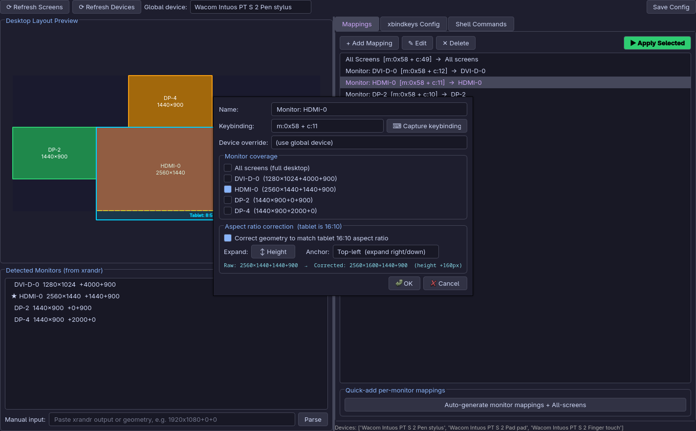

# Tablet Mapper

 

This application makes it easy to configure keybindings for multi-monitor layouts with xsetwacom-compatible tablets.

Integrates with xrandr for screen detection and xbindkeys for keybindings

 

## Dependencies

* Python 3.10 or newer
* PyQt6
* xrandr
* xsetwacom
* xbindkeys

## Credits

Created with Claude Sonnet 4.6

